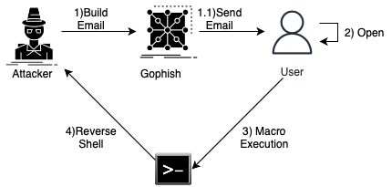
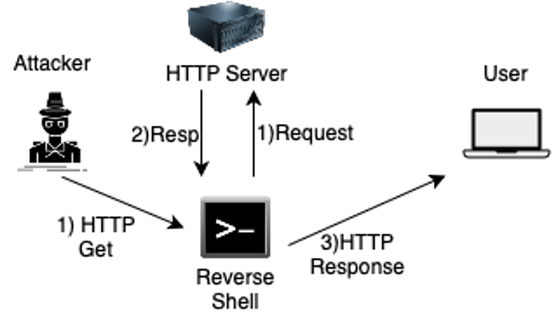
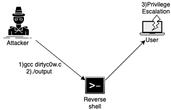

# SocialEngineering_1
Tecniche di social engineering e realizzazione di uno scenario dove una macchina vittima viene compromessa tramite apertura di un canale di comunicazione con l'attaccante

Questo elaborato ha l’obiettivo di analizzare le principali tecniche di social engineering, sviluppando uno scenario pratico che utilizza il phishing, una delle tecniche esaminate, come vettore di attacco.

Viene fornita una panoramica delle tattiche e tecniche impiegate nello scenario, facendo riferimento al framework MITRE ATT&CK per la loro classificazione:
|Tattica|Tecnica|ID Tecnica|
| --- | --- | --- |
|Initial Access | Phishing | T1566 |
|Execution | User Execution | T1204|
| Command and Control | Application Layer Protocol | T1071 |
|Privilege Escalation | Exploit for Privilege Escalation | T1068 |
|Impact | Data Manipulation | T1565 |

1)Nella prima fase viene impiegato il framework GoPhish per la creazione di una campagna di phishing. In questo scenario, l'attacco è simulato prendendo di mira un singolo utente. Il framework è stato configurato utilizzando il server SMTP di Gmail. L'email inviata ha come contenuto un documento open office contenente una macro malevola.

2)Nella seconda fase viene infettata la macchina avversaria utilizzando la macro presente nel documento. In particolare la macro presenta un comando che permette l'esecuzione su shell di una reverse shell sulla macchina attaccante, in ascolto sulla porta 4444. 
Segue poi l'attivazione di un server http sulla macchina attaccante che permette, in combinazione con la reverse shell, di prendere il controllo pieno della macchina vittima con il trasferimento di file.

3)Nella terza fase, il canale di comunicazione stabilito viene utilizzato per sfruttare una nota vulnerabilità presente nei sistemi Ubuntu, denominata "Dirty C0W" (CVE-2016-5195), la quale consente un'escalation dei privilegi. L'exploit viene eseguito tramite un codice scritto in C, eseguito direttamente sulla macchina target.

